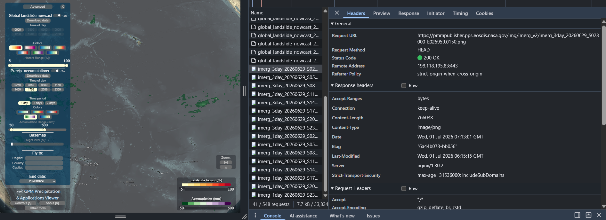

# NASA GPM Research Task

After the Panahon rainfall map works, the intern should study NASA GPM precipitation visualization. No coding is required yet unless the visualization approach is obvious and easy.

Reference link: https://gpm.nasa.gov/data/visualization/precip-apps

* **What NASA GPM or IMERG layers are available?**
    * Primarily **precipitation accumulation** and **global landslide nowcast**. Specifically:
        * 30-minute precipitation
        * 1-day precipitation
        * 3-day precipitation
        * 7-day precipitation
        * Landslide nowcast
* **Is there a public tile service, WMS, WMTS, XYZ endpoint, or API endpoint?**
    * The PMM Precipitation & Applications Viewer identifies itself as a demonstration of the PMM Publisher API. However, the linked "API" pages **do not provide conventional REST API documentation**.
    * Inspection of the application's network traffic shows that precipitation layers are retrieved as **publicly accessible PNG image resources** hosted on `pmmpublisher.pps.eosdis.nasa.gov`. No JSON-based REST API, standard XYZ tile service, or documented WMS/WMTS endpoint was identified from the viewer itself.
    
    * The application appears to construct image URLs for different datasets, dates, and time intervals rather than querying a JSON service.
* **Can it be added directly to MapLibre?**
    * **Potentially**, but not directly based on the available documentation. The viewer retrieves precipitation imagery as PNG files, but no documented MapLibre-compatible tile service (e.g., XYZ or WMTS) was identified.
* **Does it require authentication?**
    * Specifically for the visualization, the published imagery appears to be publicly accessible without authentication.
* **What time intervals are available?**
    * For the GPM Precipitation & Applications Viewer:
        * Landslide nowcast every 3 hours
        * Precipitation accumulation every 3 hours and accumulation periods within:
            * 1 day
            * 3 days
            * 7 days
    * For the GPM IMERG Global Viewer, latest precipitation accumulations from:
        * 30 minutes
        * 24 hours
        * 7 days
* **What spatial resolution is available?**
    * According to `gpm.nasa.gov`, "For our popular multi-satellite GPM IMERG data products, the spatial resolution is **0.1° x 0.1° (or roughly 10km x 10km)** with a 30 minute temporal resolution".
* **What is the update frequency?**
    * According to `gpm.nasa.gov`, IMERG Near Real-Time precipitation estimates are updated approximately **every half-hour**, although publication may occur shortly after each observation period.
* **Can the data be filtered or clipped to the Philippines?**
    * Yes. Since the datasets are global, the application can limit the displayed region to the Philippines **by controlling the map extent**.
* **What is the easiest first visualization approach?**
    * The easiest prototype would be to display NASA's published precipitation imagery as a raster overlay in MapLibre, provided that a compatible image or tile service can be identified. This avoids the need to process scientific data formats such as NetCDF or GRIB in the frontend.